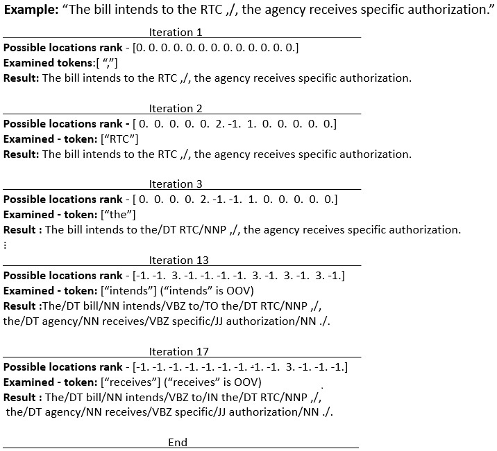

# Intro_to_NLP
Python version: 3.7.9

Install requirements:
```
pip install -r requirements.txt
```
Download and unzip the files:
1) Part Of Speech data - "pos.tgz".
2) Name Entities Recognition - "ner.tgz".


**Part 1:**

Given a text, assign each word in the text its correct part-of-speech based on the out-of-the-box vectors, without
training any classifiers.

Solution:
The algorithem can be looked at in the following way: While not all the words are tagged, the iteration continues.
At the beginning all locations have value of zero, the word with the highest count is chosen and essentially become a "seed" for tagging ( because, now it's left location have the value of 2 and the tight location have the value of 1).
The tagging continue to the left side, until unknown word is encountered or beginning of sentence. Then the tagging is continued to the right. If another unknown words or end of sentence is encountered, then a new "seed" is planted.
This process continue until all words in the sentence are tagged. Example of tagging process, with the proposed locations and the POS tag are described in Figure.

For more details, please read the document.

1.1
Goal: 
Using only word count.

Usage:
```
python create_pos_1.py -itr INPUT_TRAIN -id INPUT_DEV -it INPUT_TEST -ot OUTPUT_TEST
```

1.2
Goal: 
Using word count and static word vectors.


Usage:
```
python create_pos_1.py -itr INPUT_TRAIN -id INPUT_DEV -it INPUT_TEST -ot OUTPUT_TEST
```

1.3
Goal:
Using word count and static/Contextualized word vectors.


Usage:
```
python create_pos_1.py -itr INPUT_TRAIN -id INPUT_DEV -it INPUT_TEST -ot OUTPUT_TEST
```
**Part 2:**

Goal: 
perform named entity recognition

Usage:
```
python create_pos_1.py -itr INPUT_TRAIN -id INPUT_DEV -it INPUT_TEST -od OUTPUT_DEV -ot OUTPUT_TEST
```
